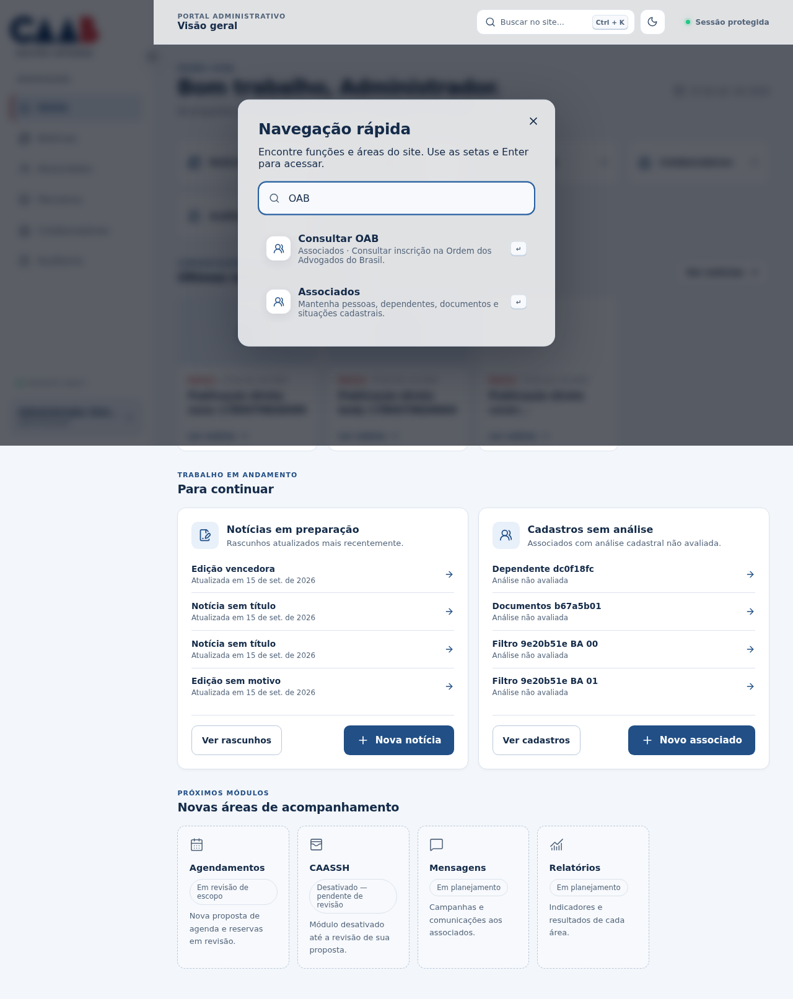

# Busca geral por funções — 15/09/2026

**Buscar no site** encontra funções e áreas existentes, com prioridade para o destino específico.
Exemplos verificados: OAB → /members/oab, beneficios → /partners/benefits, alterar senha →
/settings#password-title. Inclui unidades, categorias, configurações de convênios, rascunhos,
cadastros, acessos, documentos, exportação, processamentos e funções da própria conta.

Resultados indicam a área e, quando necessário, que é preciso escolher um cadastro antes de
usar a função. Nenhuma mutação é executada pela busca. Cada entrada respeita leitura da área
e permissões adicionais; funções indisponíveis não são anunciadas. Menu e dashboard continuam
usando o catálogo de áreas. Busca normaliza acentos, caixa e ordem das palavras; Ctrl+K,
setas, Enter e Escape preservados. Links de resultados não antecipam carregamentos no servidor.

[CI final 34976399886](https://github.com/Komunick/caabnovo/actions/runs/34976399886), commit591cf00, aprovado:
testes verificam ordenação/destinos/sinônimos, negação com escrita sem leitura, nomes sem acento,
operador somente de jobs e funções de conta. E2E abriu OAB e benefícios por teclado, conferiu
atalho da senha e acesso negado; acessibilidade no desktop e celular. Capturas sintéticas revisadas.

Pesquisa oficial registrada em [research.md](../research.md). Implementação leve no navegador,
sem serviço, dependência ou índice de dados pessoais novo. Registros não são pesquisados por esta função.

Preview atualizado com o build591cf00 e conferido no Chrome: busca OAB e beneficios aponta para
as funções específicas; nenhuma consulta externa à OAB foi disparada pela revisão da navegação.

