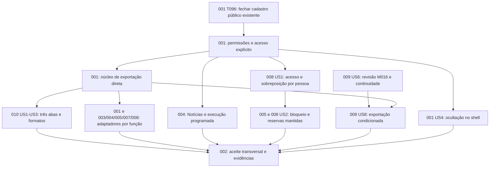

# Plan e tasks — encerramento de 21/09/2026

**Entrega:** `docs/project-clarify-20260921`, base de código ed31baf.
**Resultado:** plan executado primeiro, depois tasks; dez conjuntos documentais
atualizados. Pesquisa oficial, modelo, contratos e quickstart por função. Os arquivos
de código indicados são destinos de tarefas futuras, não arquivos criados nesta rodada.

## Tarefas novas

Foram detalhadas **108 tarefas novas**, todas pendentes. IDs reiniciam apenas entre
specs: identificar tarefa por spec+ID. Contagem não inclui tarefas antigas ou aliases
EX/DX/AC/BEN/BLQ/EXP, nem mede percentual do produto. Tarefas concluídas e referências anteriores
permanecem preservadas; referências duplicadas/suspensas de 002 foram conciliadas
pela revisão de código e remetem aos specs responsáveis; a seção ativa indica substituição/detalhamento sem execução dupla.

| Spec | IDs novos | Total | Distribuição por história |
| --- | --- | ---: | --- |
| [001](../001-project-foundation/tasks.md) | T098–T120 | 23 | Transversal: 16, US1: 1, US2: 3, US4: 2, US5: 1 |
| [002](../002-integrated-modules/tasks.md) | T098–T108 | 11 | Transversal: 3, US1: 1, US2: 1, US3: 1, US4: 1, US5: 1, US6: 1, US7: 1, US10: 1 |
| [003](../003-audit-operations/tasks.md) | T015–T022 | 8 | Transversal: 3, US2: 1, US5: 4 |
| [004](../004-news-publishing/tasks.md) | T029–T038 | 10 | Transversal: 3, US1: 1, US2: 1, US3: 1, US4: 4 |
| [005](../005-members-management/tasks.md) | T041–T049 | 9 | Transversal: 3, US3: 1, US4: 1, US5: 4 |
| [006](../006-account-settings/tasks.md) | T026–T029 | 4 | Transversal: 3, US3: 1 |
| [007](../007-partners-management/tasks.md) | T039–T045 | 7 | Transversal: 3, US5: 4 |
| [008](../008-scheduling-management/tasks.md) | T025–T039 | 15 | Transversal: 3, US1: 6, US2: 2, US4: 4 |
| [009](../009-messaging/tasks.md) | T001–T008 | 8 | Transversal: 3, US6: 1, US8: 4 |
| [010](../010-reports-analytics/tasks.md) | T027–T039 | 13 | Transversal: 4, US1: 1, US2: 6, US3: 1, US4: 1 |

Cada tasks.md contém critério independente por história, caminhos de arquivos,
ordem, dependências, paralelismo e estratégia incremental. Setup/Foundational/Polish
não recebem rótulo US; tarefas de história recebem. [P] aparece somente em arquivos
independentes após seus pré-requisitos; nenhum agente de implementação foi iniciado.

## Dependências e MVP

**MVP recomendado:** invariantes de acesso e núcleo compartilhado, comprovados por
uma jornada completa de Relatórios nas três abas/formatos. Depois completar todos
os adaptadores previstos; esse marco não retira os demais módulos do pedido.
Q1/Q2 da agenda podem evoluir paralelamente após suas permissões. Spec009 permanece
condicionada a M016; sua pendência não impede concluir módulos independentes.

Paralelismo: writers CSV/XLSX/PDF após contrato/pipeline; adaptadores por domínio
após núcleo; correções de agenda/notícias após catálogo; relatórios de aceite com
arquivos próprios. Não editar o mesmo schema/catálogo/migration em duas frentes.

## Decisões técnicas e evidências

- Uma chave exports:generate; migração preserva concessões temporárias e override,
  separada da retirada do baseline implícito de Notícias. scheduling:read/write sem
  backfill de acesso. Leitura pública de notícias permanece.
- Geração incremental na requisição com download nativo, três writers, filtros e
  colunas autorizados, estado operacional sem fila/histórico obrigatório. Limites
  físicos tratados por planilhas/continuações/paginação, sem truncamento ou teto funcional.
- Reautorização atual por lote/IDs/campos e capacidade de controle separada do cursor;
  abort/falhas fecham recursos. Erros do frame comunicados com origem/source validados.
- GiST por beneficiário e intervalo global; diagnóstico de conflitos antigos antes
  da migration. Se existirem, não alterar reservas automaticamente. Aviso de bloqueio
  derivado preserva estado e ocupação; cancelamento manual permanece.
- Notícias também exige correção do worker; Relatórios deve proteger agregados e
  cancelamentos de Agendamentos, não só o dataset detalhado. Arquivos de auditoria
  legados exigem proteção contra bypass pelo download genérico.

Fontes, alternativas e limites na [pesquisa](research-2026-09-21.md), protocolo em
[contrato comum](contracts/direct-exports.md), modelos/roteiros nos planos próprios.
Não houve teste de aplicação, benchmark, instalação, migration ou consulta a dados reais.

## Pendências preservadas

Retenção Q10/T089, dependentes/documentos Q11/P01, OAB hospedada, SMTP real autorizado,
rulesets remotos, revisão visual CAL06, consumidores app/site, canais de Mensagens,
chat interno, suporte, RH/portal/CAASSH e demais expansões mantêm os estados anteriores.
T096/T097 de Fundação permanecem prioritárias, com seus IDs; não foram concluídas
nem diluídas pela criação da lista nova. T025 anterior de010 é detalhada nesta entrega;
T026 externa continua adiada. M016 é gate de produto, não aprovação presumida.

## Conciliação normativa

Constituição **2.0.0**, de 1.1.1: MAJOR pela retirada da obrigação de justificativa,
conforme decisão já tomada em 14/09. Autorização, confirmação, auditoria e motivos
históricos preservados. Nenhum template alterado; emenda preparada sem aprovação
de PR presumida. DOC01 recebeu correções em constituição/contratos/modelos/plans;
sua revisão final permanece tarefa explícita antes da implementação/entrega.
Sugestão de commit futuro: `docs: plan clarified access, scheduling and exports`.

## Verificação documental

Scripts setup-plan e setup-tasks concluídos nas dez specs, nessa ordem. O seletor local feature.json
não existia no início desta worktree; os scripts o criaram e ele foi deixado em 002
(programa coordenador), fora dos arquivos versionados. Templates existentes carregados. Hooks não configurados:
`.specify/extensions.yml` ausente. Backup prévio com hashes SHA256 verificados.
Validação de IDs/formato/caminhos/links, preservação de tarefas concluídas e remissões históricas,
estrutura Markdown e diff conferidos. Prettier foi invocado, mas a configuração do
projeto exclui docs/specs/.specify; portanto seu retorno não é evidência de formatação
desses arquivos. Não foi alterada a configuração para contornar essa exclusão. Todos os testes descritos
nas tarefas são futuros; evidências antigas não os concluem.

Próximo passo recomendado: **$speckit-analyze**, para revisão cruzada antes de
**$speckit-implement**. Nenhum dos dois foi invocado automaticamente nesta rodada.
Sem commit, push, PR, aprovação ou merge; localhost continua desligado.

### Resultado da verificação final

108 tarefas novas: IDs contíguos/únicos dentro de cada spec, checkbox pendente,
rótulo US na fase correta e caminhos explícitos. 72 destinos ainda não existentes
registrados em [inventário de caminhos](planned-paths-2026-09-21.md). Links dos
artefatos novos/atuais resolvidos; blocos Markdown das listas válidos. Backup de171
arquivos conferido por SHA256. Tarefas concluídas preservadas; remissões históricas
de002 e DOC01 conciliadas com a revisão documental paralela, sem execução duplicada.
Diff contém somente documentação, sem código/configuração da aplicação. Scripts e
artefatos locais de apoio permanecem fora do PR. Testes de aplicação não executados.

### Complemento autorizado durante o analyze — 21/09/2026

Consulta OAB excluída da exportação por decisão explícita do usuário: sem botão ou dataset do resultado, avulso ou pelo cadastro. Atualizadas T045/T047/T048 de005 e os contratos/planos; permanecem108 tarefas novas pendentes. Esta alteração documental não implementa funções nem conclui o analyze em andamento.

### Respostas ao analyze — I1 e D1, 21/09/2026

I1 resolvido no desenho por decisão explícita: [três cargos](../001-project-foundation/contracts/roles.md), Administrador com todo o catálogo, Gestor com consulta global/exportação/Relatórios completos e concessão a terceiros, sem autogestão, Colaborador sem concessão. Ajustadas tarefas existentes001/006; nenhum cargo criado no banco. D1 corrigido para003 US5 exportação, mantendo US4 histórico. Permanecem108 tarefas novas pendentes. U1 e C1 seguem em esclarecimento; nenhuma correção desses pontos aplicada.

### Respostas U1/C1 — 21/09/2026

U1 aprovado: [downloads antigos](../010-reports-analytics/contracts/legacy-downloads.md) exigem acesso atual a todas as fontes, incluindo dependências omitidas dos snapshots. C1: usuário escolheu [100 registros](export-validation-100.md) para esta etapa; substitui as provas grandes antes previstas, sem limitar o produto. I1/D1 já registrados. As108 tarefas novas continuam pendentes, com T104(001)/T031/T038(010) ajustadas; nenhum código/teste executado. Sem pretensão de homologação de escala, sem reativação local.
