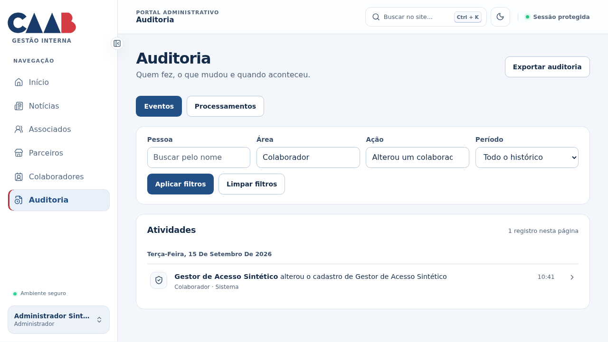
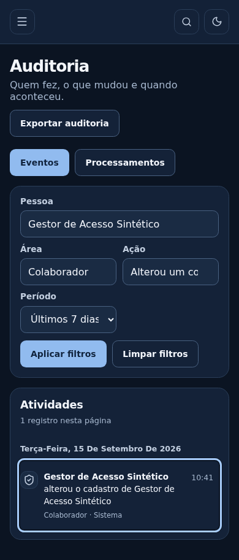
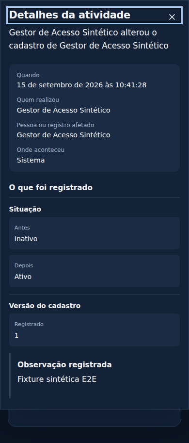

# Auditoria em linguagem simples — 15/09/2026

## Resultado

Histórico de atividades agrupado por data, com autoria e descrição em português. Selecionar
um evento abre um painel lateral; no celular, ocupa a largura da tela. Os detalhes mostram
quem/quando/onde/alvo e valores anteriores/novos de situações, acessos, formatos, canais,
prazos, avaliações, fotos e versões reconhecidos. JSON, códigos e identificadores ficam
somente em **Informações para suporte**, recolhidas no final do painel.

Filtros de área e ação usam input/datalist, como Estado de Parceiros: permitem digitar ou
selecionar rótulos, rejeitam texto sem correspondência e preservam os códigos no contrato/URL.
Busca de pessoa é paginada e exige audit:read + users:read; mantém filtros na exportação.

## Segurança e limites dos dados

- Colaboradores e perfis usam users:read/roles:read para seus nomes atuais.
- Nomes de associado/convênio, título de notícia e nome de arquivo exigem leitura da área;
  arquivo exige também files:read e leitura de sua área proprietária.
- Enriquecimento de alvos cruza concessões atuais e sessão ativa com as permissões recebidas.
  Consulta em lote somente nomes/títulos; não carrega contatos, documentos ou conteúdo de arquivos.
- Identificação atual não reconstrói o nome histórico. Campos redigidos/ausentes/desconhecidos
  não são inventados, e enums desconhecidos não aparecem como código na leitura humana.
- Eventos permanecem imutáveis, com redação original e JSONL de exportação preservados.
  Escape restaura o foco ao evento; abrir detalhes não muda filtros nem realiza ações.

## Validação

[CI final 34976399886](https://github.com/Komunick/caabnovo/actions/runs/34976399886),
commit 591cf00, aprovado com quality, security e browser:

- 276 unitários, 94 contratos e 152 integrações.
- 62 E2E Chromium e 6 testes de acessibilidade, sem retries ou flakies.
- Formatação, lint, tipos, build de produção, proteção de branches e verificação de segredos/dependências.

A suíte cobre também as buscas e a retirada do MinIO entregues na mesma branch.

Cobertura: acesso negado antes de buscar nomes, busca literal/paginação de autores,
nomes ausentes, compatibilidade de links antigos, proteção de snapshots, before/after,
suporte recolhido, teclado/foco, celular, filtros combinados e exportação autorizada.
Dados de teste e capturas do CI são sintéticos; nenhum seed no banco do preview.

## Pesquisa e revisão

[Pesquisa de mercado e decisão](../research.md): padrões de GitHub, Atlassian e Microsoft
adaptados à leitura administrativa. Preview usa build remoto para poupar memória/CPU locais.
Revisão local verificou painel humano, foco inicial, identificação do associado e nome de arquivo,
além de Área/Ação digitáveis. Preview localhost:3107 executa o build591cf00, preserva o banco e
mantém limites de memória/CPU. A evidência desta seção não cobre implantação na hospedagem.

## Capturas sintéticas finais

