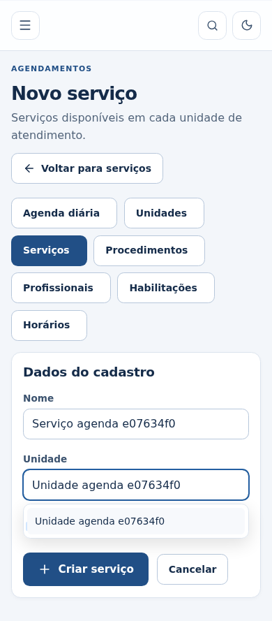

# Campos combinados e edição de Agendamentos — 16/09/2026

Um único campo permite digitar, consultar sugestões e selecionar por ID com mouse ou teclado. Busca, paginação, dependências e erros continuam funcionais. O retorno entre unidades/serviços preserva campos, e Voltar à lista conserva cada cadastro separadamente; Cancelar limpa apenas a edição atual. Reservas, remarcações e horários usam a mesma preservação.

## Evidências

`choice.test.tsx`, jornadas de navegação em `workspace-drafts.spec.ts` e a jornada completa em `scheduling.spec.ts`. Captura `scheduling-combobox-mobile-light.png` para revisão do campo e sugestões a390px.

[CI validado em 16/09/2026](https://github.com/Komunick/caabnovo/actions/runs/35107236105):
quality, browser e security concluídos com sucesso. Inclui 313 testes unitários,
105 de contrato, 182 de integração, 73 E2E e 6 verificações de acessibilidade,
além de formatação, lint, typecheck e build. As capturas sintéticas ficam nos
artifacts `workspace-drafts-synthetic-evidence` e `scheduling-synthetic-evidence`.
A entrega inclui também regressão unitária para limpar o erro do campo assim que
uma opção válida é escolhida; o resultado do commit final acompanha o PR.

## Limites

A retenção vale durante a navegação no painel autenticado. Salvar/cancelar trata
somente o formulário correspondente; falhas conservam os dados e o servidor
continua validando versões e autorizações. Encerrar a sessão ou fechar/recarregar
a página inteira limpa a memória. Não há gravação automática no banco.

Banco e contas locais preservados, sem build ou E2E no computador; cenários de
navegador usam exclusivamente contas e registros sintéticos no CI.

## Captura revisada

